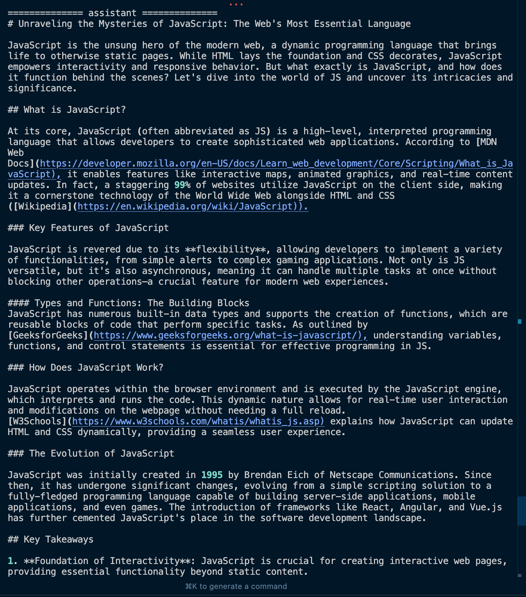

# Python Multi-Agent Workflow Demo 🤖


[](https://www.python.org/downloads/)
[](https://openai.com/)
[](LICENSE)



This project demonstrates a multi-agent workflow system for automated blog post generation using Python and OpenAI's GPT models. Based on the tutorial by [Jie Jenn](https://www.youtube.com/@jiejenn) and powered by [Agno.ai](https://agno.ai).

## 🌟 Features

- Multi-agent collaboration system
- Automated blog post generation
- Role-based agent interactions
- Content review and refinement pipeline

## 🛠️ Prerequisites

- Python 3.9+
- OpenAI API key
- Required Python packages (see Installation)

## 📦 Installation

1. Clone the repository:

```bash
git clone https://github.com/pakagronglb/python-multi-agent-workflow-agno.git
cd python-multi-agent-workflow-agno
```

2. Create and activate a virtual environment:

```bash
python -m venv venv
source venv/bin/activate  # On Windows, use: venv\Scripts\activate
```

3. Install dependencies:

```bash
pip install -r requirements.txt
```

4. Set up environment variables:
   - Create a `.env` file in the root directory
   - Add your OpenAI API key:
     ```
     OPENAI_API_KEY=your_api_key_here
     AGNO_API_KEY=your_api_key_here
     ```

## 🚀 Usage

1. Run the main workflow:

```bash
python blog_post_generator_workflow.py
```

2. For testing and development, use the playground version:

```bash
python blog_post_generator_workflow_playground.py
```

## 🤝 Credits

- Tutorial by [Jie Jenn](https://www.youtube.com/@jiejenn)
- Multi-agent framework powered by [Agno.ai](https://agno.ai)

## 📄 License

This project is licensed under the MIT License - see the [LICENSE](LICENSE) file for details.

## 🤝 Contributing

Contributions, issues, and feature requests are welcome! Feel free to check the [issues page](issues).

## 📬 Contact

For questions and feedback, please reach out through:
- GitHub Issues
- pakagronglebel@gmail.com

---
⭐️ If you found this project helpful, please consider giving it a star!
